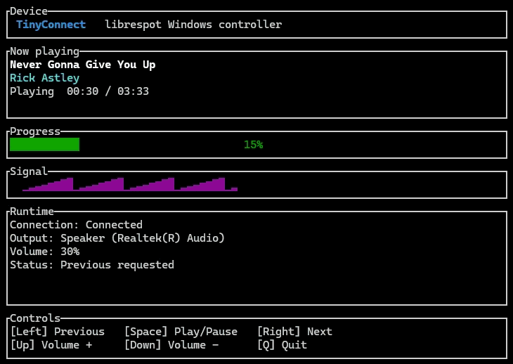

  

<h1 align="center">TinyConnect</h1>

  A compact Windows terminal controller for a local Spotify Connect device.

  

TinyConnect v0.1.0 is a small Windows terminal controller for a local Spotify
Connect device powered directly by librespot
(https://github.com/librespot-org/librespot). It displays the current track and
controls the active player without using the Spotify Web API, client IDs, or an
OAuth application of its own.

TinyConnect advertises itself as TinyConnect on the local network. Select it
from a Spotify client, then use the terminal controller to play, pause, skip,
and adjust the Windows playback volume.

## Controls

| Key | Action |
| --- | --- |
| Left | Previous track (or restart the current track) |
| Space | Play/pause |
| Right | Next track |
| Up | Increase Windows playback volume by approximately 5% |
| Down | Decrease Windows playback volume by approximately 5% |
| Q | Shut down cleanly |

TinyConnect resolves the Windows default render endpoint when it starts and
uses that same endpoint for its lifetime. The Runtime area displays the
endpoint friendly name and current Windows master volume. If the Windows
default output changes while TinyConnect is running, quit and restart
TinyConnect to use the newly selected endpoint.

## Download the release

Download `TinyConnect-v0.1.0-windows-x86_64.zip` from the [GitHub
Releases](https://github.com/arlyngoodrich/TinyConnect/releases) page and
extract it. The release package includes the Windows executable, launcher,
license, README, and canonical TinyConnect assets. Rust and Cargo are not
required to run the released executable.

From the extracted package:

~~~powershell
.\scripts\Start-TinyConnect.ps1
~~~

The helper opens a new 80-column by 27-row Windows Terminal window when
wt.exe is available. TinyConnect runs inside that dedicated window and the
window closes after Q. If Windows Terminal is unavailable, the helper runs in
the current shell. In either case, it runs target\release\tinyconnect.exe
directly when that release build exists. If the executable is absent and Cargo
is available, it falls back to cargo run --release. If neither is available,
it reports the exact missing executable and the Rust build command needed to
create it.

## Build from source

Requirements:

- Windows 10 or newer
- Rust 1.85 or newer
- A Spotify Premium account for Spotify Connect playback

No credential, audio, or application cache is enabled by TinyConnect. The
application does not include or use CLIAMP.
TinyConnect starts the Spotify Connect volume at 100% while leaving remote
Connect volume control enabled. Windows volume is the intended normal volume
control; Up and Down change the Windows endpoint volume without changing the
Spotify Connect volume.

~~~powershell
cargo run --release
~~~

The first run opens a terminal UI and waits for a Spotify client to select
TinyConnect. Use Q before closing the terminal window so librespot and the
Connect advertisement can shut down cleanly.

## Project boundaries and attribution

TinyConnect is an unofficial independent project and is not affiliated with,
endorsed by, or sponsored by Spotify AB. Spotify and the Spotify logo are
trademarks of Spotify AB.

TinyConnect uses the open-source librespot library for Spotify Connect session,
discovery, and playback behavior. See the upstream project and its license at
https://github.com/librespot-org/librespot.

Spotify account access, availability, and service behavior remain controlled by
Spotify. TinyConnect does not bypass account requirements or DRM and makes no
guarantee about service availability.

## License

TinyConnect is released under the MIT License. See LICENSE.
